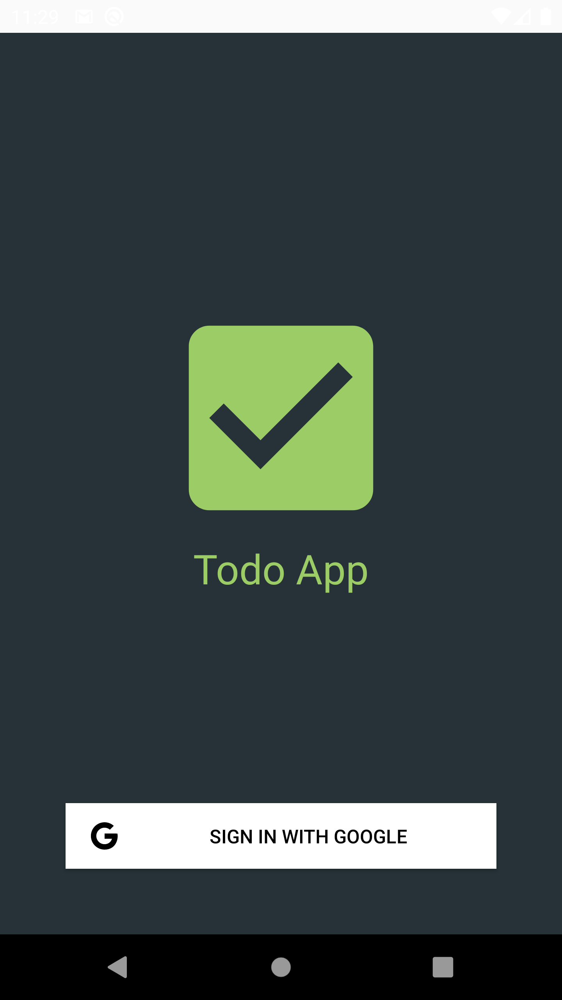
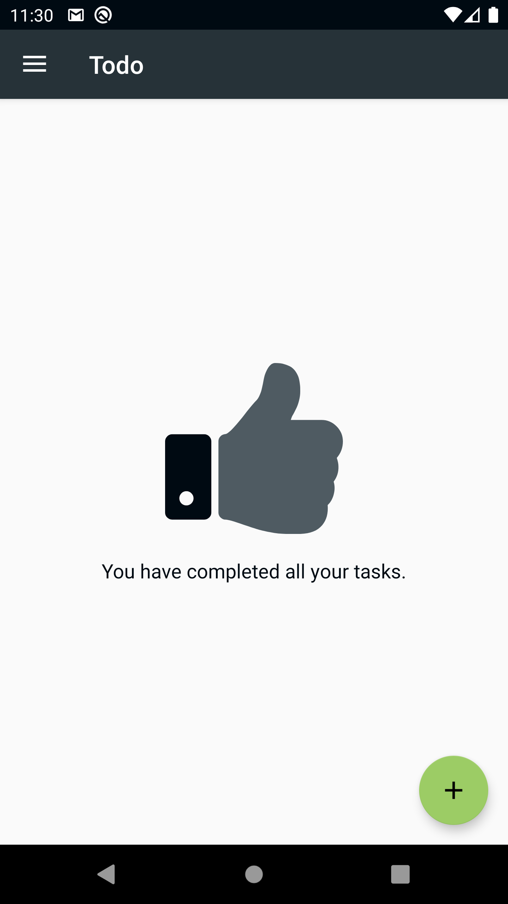
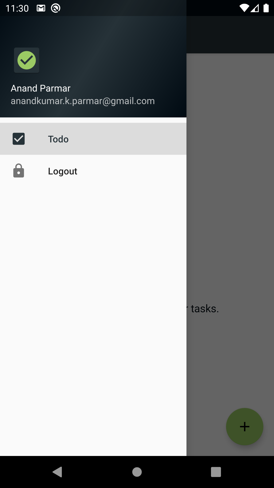
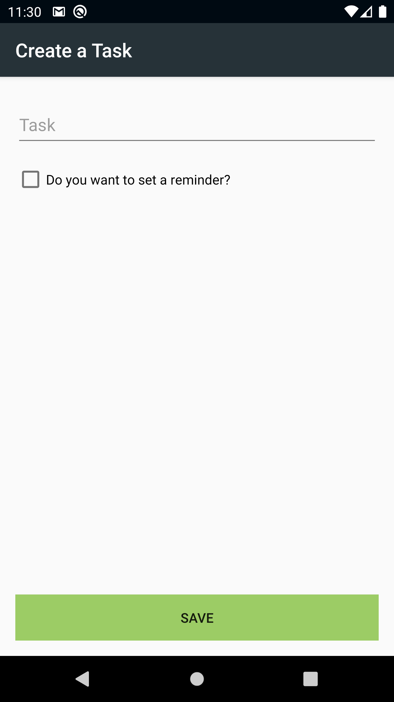
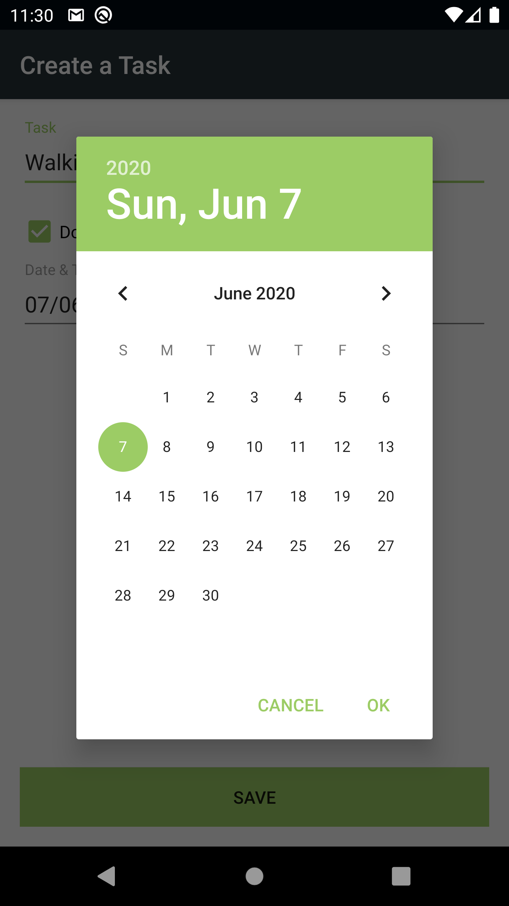
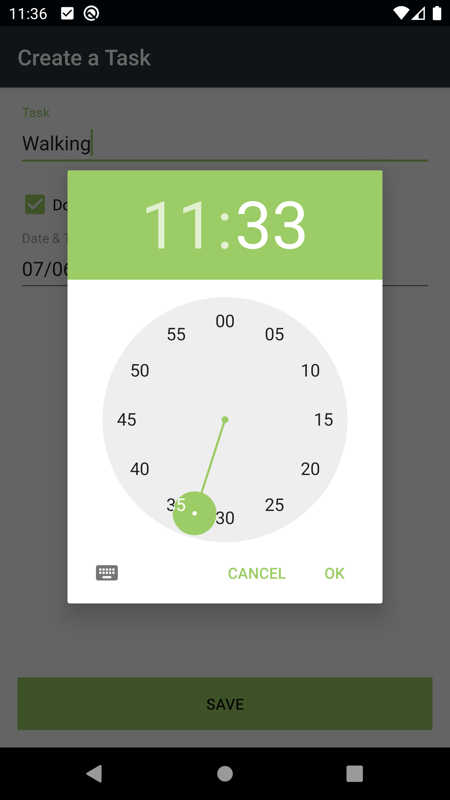
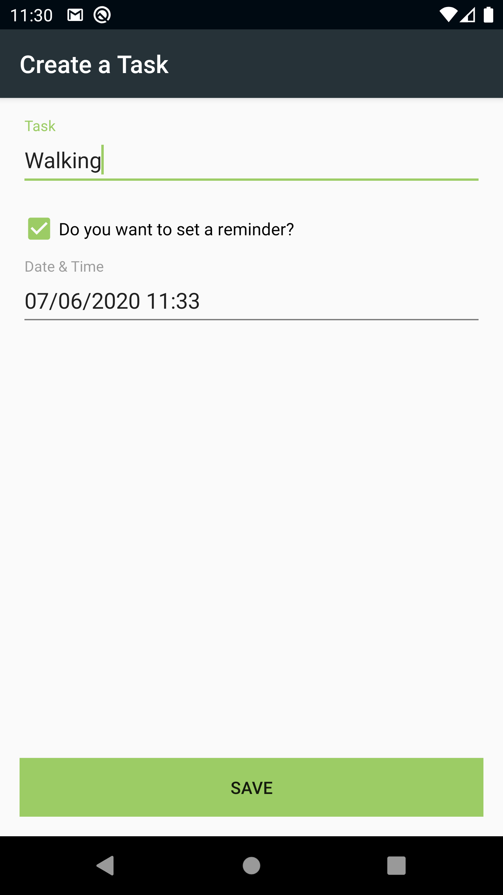
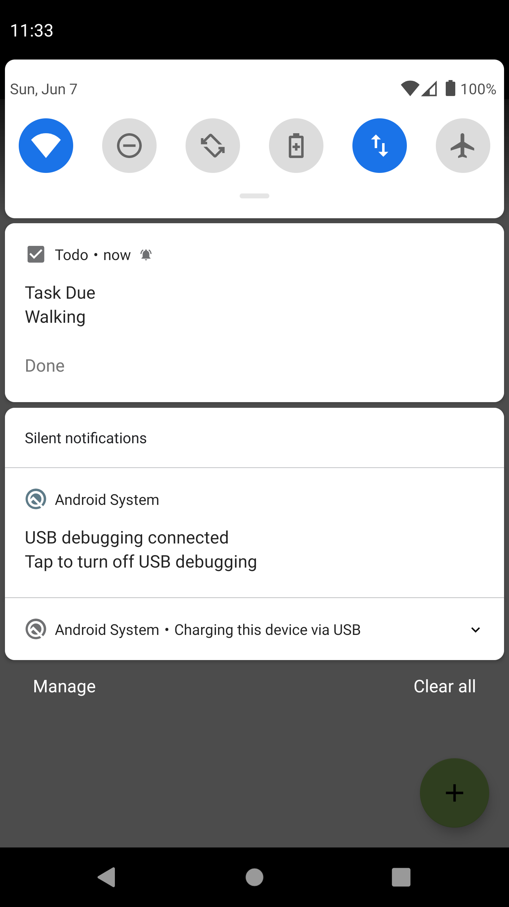
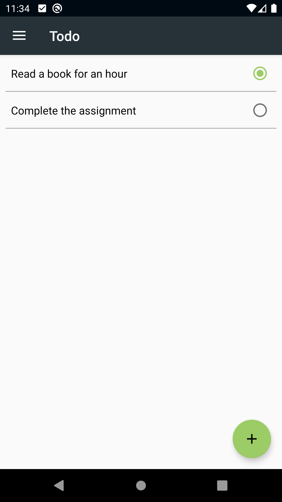

# Todo
Todo App - Simple yet powerful with Reminders to make you updated with your task.

**Features:** 
- Login with Google to give personalize data.
- Add a Todo Task with reminder notification.
- Notify with exact time, so you can complete you task.
- You can make complete the task directly from notification.
- Classic and Material design

**Topic covered:**
- Firebase Login (Google SignIn)
- Notification
- Broadcast Receivers
- Room Database
- Repository
- MVVM Architecture
- Navigation View
- Coroutine
- Live data

**Special Thanks:**
- [Picasso](https://square.github.io/picasso/)
- [Icons8](https://icons8.com/)

**ScreenShots:**

  
  
  

  
  
  

  
  
    

